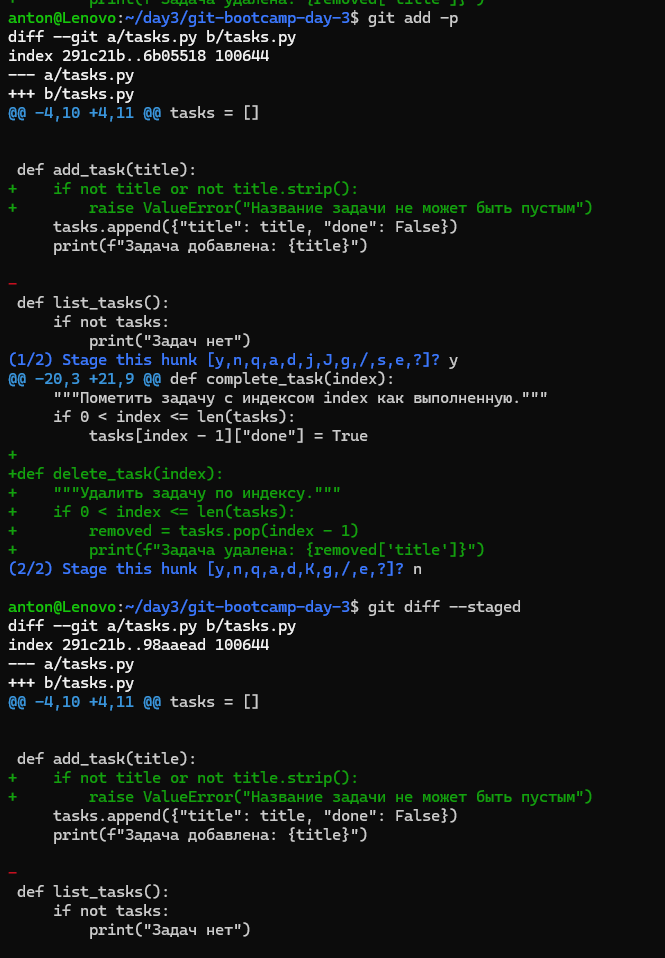
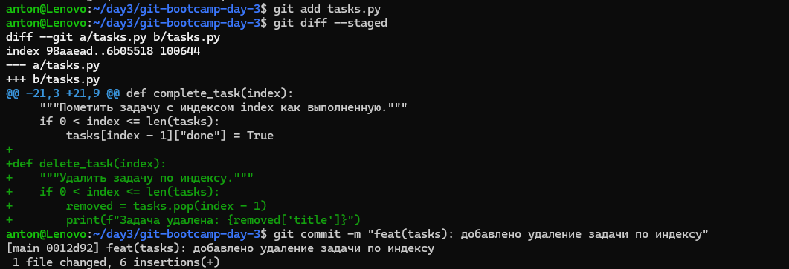
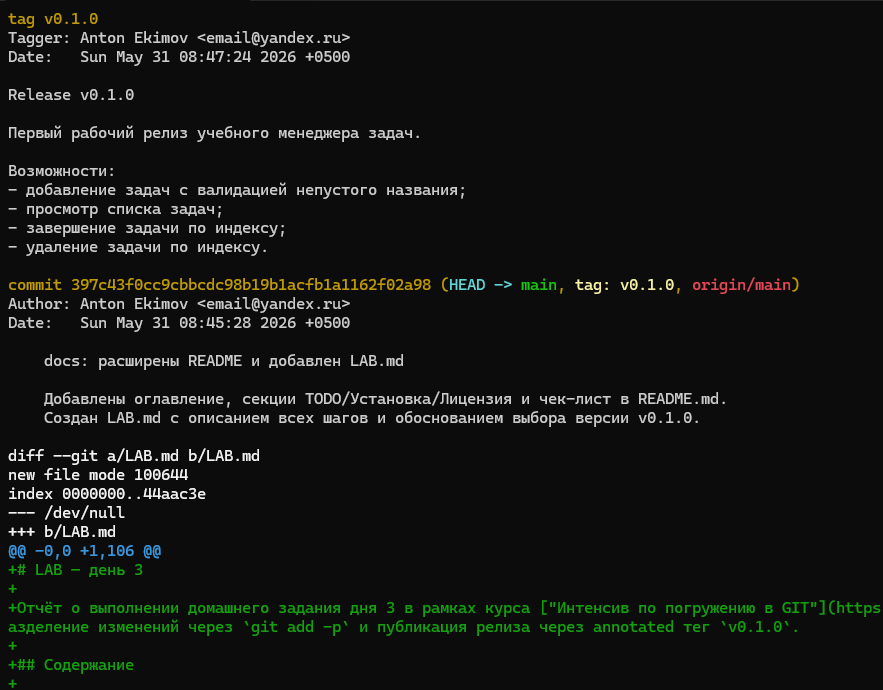
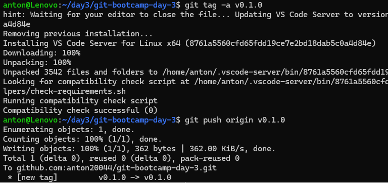
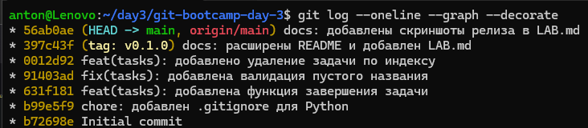

# LAB — день 3

Отчёт о выполнении домашнего задания дня 3 в рамках курса ["Интенсив по погружению в GIT"](https://slurm.io/git-intensive): построение реальной истории на ветке `main` с использованием Conventional Commits, разделение изменений через `git add -p` и публикация релиза через annotated тег `v0.1.0`.

## Содержание

- [LAB — день 3](#lab--день-3)
  - [Установка](#установка)
  - [Лицензия](https://mit-license.org/)
  - [Содержание](#содержание)
  - [Шаг 1. Initial commit](#шаг-1-initial-commit)
  - [Шаг 2. chore: .gitignore](#шаг-2-chore-gitignore)
  - [Шаг 3. feat(tasks): complete\_task](#шаг-3-feattasks-complete_task)
  - [Шаг 4. fix(tasks): валидация через add -p](#шаг-4-fixtasks-валидация-через-add--p)
  - [Шаг 5. feat(tasks): delete\_task](#шаг-5-feattasks-delete_task)
  - [Шаг 6. docs: расширенный README и LAB](#шаг-6-docs-расширенный-readme-и-lab)
  - [Релиз: тег v0.1.0](#релиз-тег-v010)
  - [Почему именно v0.1.0](#почему-именно-v010)
  - [Финальная история](#финальная-история)

##Установка
<details>
<summary>Копирование репозитория</summary>

```bash
git clone git@github.com:anton20044/git-bootcamp-day-3.git
cd git-bootcamp-day-3.git
```

</details>


## Шаг 1. Initial commit

В Initial commit добавлен README.md и tasks.py

## Шаг 2. chore: .gitignore

.gitignore взят с [ресурса](https://www.toptal.com/developers/gitignore/api/python)

## Шаг 3. feat(tasks): complete_task

В tasks.py добавлена новая функция complete_task. Тип feat, т.к. реализована новая фича

## Шаг 4. fix(tasks): валидация через add -p

В файлt tasks.py было произведено два изменения: 
- модифицирована функция add_task
- добавлена функция delete_task
Затем была выполнена команда частичного добавления данных git add -p
- [x] Изменения в функции add_task были добавлены в репо (нажата клавиша y)
- [ ] Добавление функции delete_task было отклолнено

Скриншот интерактивной сессии `git add -p`:



## Шаг 5. feat(tasks): delete_task

Добавление функции delete_task было произведено отдельным коммитом с помощью git add, перед коммитом проверили git diff --staged

Скриншот `git diff --staged` перед коммитом:



## Шаг 6. docs: расширенный README и LAB

[FIXME: одним абзацем — что добавили в `README.md` (оглавление, секция TODO, code block, `<details>`, ссылка), какие разделы создали в `LAB.md`. Этот коммит сделали без `-m`, через редактор, с телом ≥ 2 строк.]

## Релиз: тег v0.1.0

После шага 6 запушили `main`, поставили annotated тег и запушили его:

```bash
git push origin main
git tag -a v0.1.0      # многострочное сообщение через редактор
git push origin v0.1.0
```

Скриншот вывода `git show v0.1.0` (видно `tag` объект, автора, сообщение):



Скриншот публикации тега (`git push origin v0.1.0` или страница Releases/Tags на GitHub):



## Почему именно v0.1.0

[FIXME: 1-2 абзаца. Почему выбрали `v0.1.0`, а не `v1.0.0`. На что ориентировались:
- стабильность API (мы только начали — менять что угодно);
- по SemVer мажорная `0.x` — особое соглашение «всё может ломаться»;
- что нужно, чтобы перейти на `v1.0.0`.

Также объясните, почему annotated, а не lightweight: GitHub показывает в Releases только annotated, в annotated есть автор/дата/сообщение релиза.]

## Финальная история

Скриншот ниже сделан **сразу после `git push origin v0.1.0`**, до того как был добавлен этот же `LAB.md` со скриншотами. На нём видно 6 коммитов; на последнем — `HEAD -> main, tag: v0.1.0` (тег и HEAD на одном коммите):



После того как я закоммитил актуализацию `LAB.md` со ссылками на скрины 1/4/5, в репозитории появился 7-й коммит. Теперь `HEAD -> main` указывает на него, а тег `v0.1.0` остался на 6-м коммите — на том же, где и был в момент релиза. Тег не двигается за веткой — это и есть его свойство, которое отличает его от ветки.

[FIXME: при желании добавьте сюда одной строкой результат `git rev-parse v0.1.0` и `git rev-parse HEAD` — будет видно, что хеши разные.]

